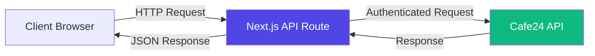
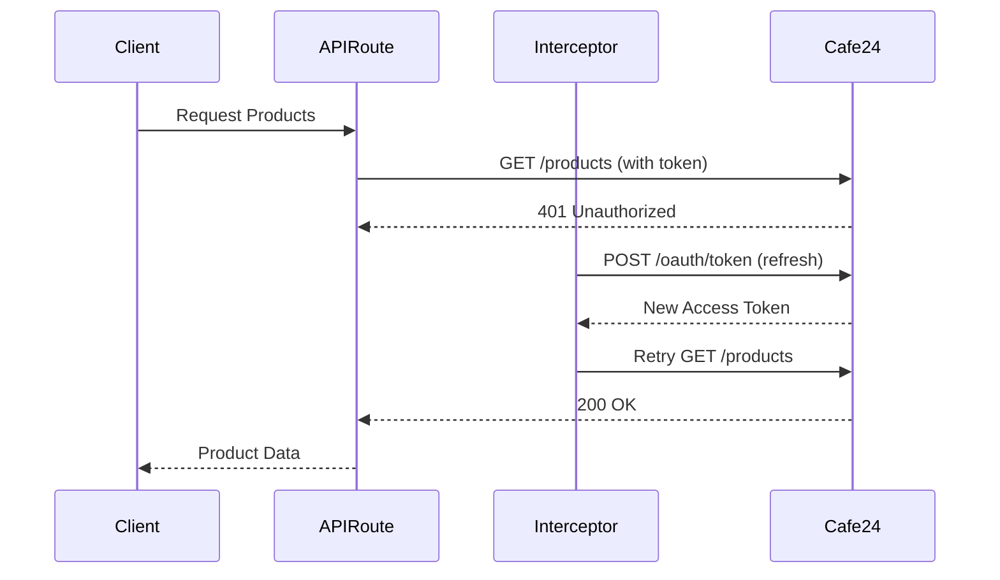

# 📊 Cafe24 Web Catalog - 프로젝트 히스토리 분석

**분석 일시**: 2026-01-23  
**프로젝트명**: cafe24-web-catalog  
**프로젝트 경로**: `/Users/ssup.pi/Public/Antigravity_Project/shopping/cafe24-web-catalog`

---

## 🎯 프로젝트 개요 (Project Overview)

### 목적 (Purpose)
Cafe24 Admin API를 활용하여 **실시간 상품 정보를 조회**하고, 현대적인 웹 인터페이스로 제공하는 **차세대 웹 카탈로그 시스템**.

### 핵심 가치 제안 (Core Value Proposition)
- **Real-time Data**: Cafe24 쇼핑몰의 실시간 상품 정보 동기화
- **Modern UX**: 직관적이고 반응형인 사용자 인터페이스
- **Professional Management**: 전문적인 전자상거래 관리 도구

---

## 🛠 기술 스택 (Tech Stack)

| Category | Technology | Version | Purpose |
|----------|-----------|---------|---------|
| **Framework** | Next.js | 15.1.4 | App Router 기반 풀스택 프레임워크 |
| **UI Library** | React | 19.0.0 | 최신 Server Components 활용 |
| **Language** | TypeScript | ^5 | 타입 안정성 확보 |
| **Styling** | Tailwind CSS | ^3.4.1 | 유틸리티 기반 스타일링 |
| **HTTP Client** | Axios | ^1.13.2 | API 통신 및 Interceptor 관리 |
| **Icons** | Lucide React | ^0.562.0 | 모던 아이콘 세트 |
| **Utils** | clsx, tailwind-merge | - | 조건부 스타일링 |

### 기술적 특징 (Technical Highlights)
- **Next.js 15 App Router**: 최신 서버 컴포넌트 아키텍처
- **React 19**: 최신 성능 최적화 및 동시성 기능
- **TypeScript**: 전체 프로젝트 타입 안정성
- **Tailwind CSS 3**: 빠른 스타일링 및 일관된 디자인 시스템

---

## 🏗 아키텍처 구조 (Architecture)

### 디렉토리 구조 (Directory Structure)

```
cafe24-web-catalog/
├── src/
│   ├── app/                    # Next.js App Router
│   │   ├── api/               # Backend API Routes
│   │   │   ├── products/      # 상품 조회 API
│   │   │   └── categories/    # 카테고리 조회 API
│   │   ├── page.tsx           # 메인 페이지
│   │   ├── layout.tsx         # 루트 레이아웃
│   │   └── globals.css        # 글로벌 스타일
│   ├── components/            # React Components
│   │   └── ProductTable.tsx   # 핵심 상품 테이블 컴포넌트
│   └── lib/                   # Utilities & Libraries
│       ├── api-client.ts      # Axios 인스턴스 + Interceptors
│       ├── cafe24-auth.ts     # Token 관리 로직
│       └── utils.ts           # 공통 유틸리티
├── docs/                      # 프로젝트 문서
│   ├── PROJECT.md            # 프로젝트 개요
│   ├── SESSION.md            # 작업 세션 로그
│   ├── DECISIONS.md          # 기술 의사결정 기록 (ADR)
│   └── GUIDE_TOKEN.md        # Cafe24 토큰 발급 가이드
├── .env.local                # 환경 변수 (API 키, 토큰)
├── .tokens.json              # 동적 토큰 저장소
└── package.json              # 프로젝트 의존성
```

### 핵심 아키텍처 패턴 (Core Architecture Patterns)

#### 1. **API Proxy Pattern**


**Why?**
- **보안 (Security)**: API 키와 토큰을 서버 사이드에서만 관리
- **CORS 해결**: 브라우저 CORS 제약 우회
- **중앙 집중식 에러 처리**: 일관된 에러 핸들링

#### 2. **Token Refresh Mechanism**


**구현 위치**: [api-client.ts](file:///Users/ssup.pi/Public/Antigravity_Project/shopping/cafe24-web-catalog/src/lib/api-client.ts)

---

## 🚀 주요 기능 (Key Features)

### 1. **실시간 상품 검색 (Real-time Product Search)**
- **Debounced Search**: 300ms 디바운스로 불필요한 API 호출 방지
- **Client-side Filtering**: 빠른 사용자 경험
- **Keyword Matching**: 상품명 기반 검색

**구현 위치**: [ProductTable.tsx](file:///Users/ssup.pi/Public/Antigravity_Project/shopping/cafe24-web-catalog/src/components/ProductTable.tsx#L58-L103)

### 2. **카테고리 필터링 (Category Filtering)**
- **Dynamic Category Loading**: Cafe24 API에서 실시간 카테고리 로드
- **Depth-1 Categories**: 최상위 카테고리만 표시
- **Category-based Search**: 카테고리별 상품 필터링

### 3. **장바구니 시스템 (Cart System)**
- **수량 관리 (Quantity Management)**: 상품별 독립적인 수량 카운터
- **장바구니 추가/제거**: 실시간 장바구니 상태 관리
- **수량 조절**: Plus/Minus 버튼으로 직관적인 수량 변경

### 4. **견적 요청 시스템 (Quote Request System)**
- **폼 기반 견적 요청**: 이름, 이메일, 전화번호, 메시지 입력
- **장바구니 연동**: 선택한 상품 목록과 함께 견적 요청
- **이메일 전송**: 견적 정보를 이메일로 전송 (구현 예정)

### 5. **반응형 디자인 (Responsive Design)**
- **Mobile-first**: 모바일 우선 디자인
- **Glassmorphism**: 현대적인 글래스모피즘 UI
- **Dark Mode Ready**: 다크 모드 지원 준비

---

## 📈 개발 타임라인 (Development Timeline)

### Phase 1: 프로젝트 초기화 (2025-12-26)
- [x] Next.js 15 프로젝트 생성
- [x] 기본 의존성 설치 (React 19, Tailwind CSS)
- [x] 프로젝트 구조 설계

### Phase 2: Cafe24 API 연동 (2026-01-09)
- [x] Cafe24 인증 시스템 구현 ([cafe24-auth.ts](file:///Users/ssup.pi/Public/Antigravity_Project/shopping/cafe24-web-catalog/src/lib/cafe24-auth.ts))
- [x] API Client 구축 ([api-client.ts](file:///Users/ssup.pi/Public/Antigravity_Project/shopping/cafe24-web-catalog/src/lib/api-client.ts))
- [x] Token Refresh Interceptor 구현
- [x] Products API Route 구현
- [x] Categories API Route 구현

### Phase 3: UI 컴포넌트 개발 (2026-01-09)
- [x] ProductTable 컴포넌트 개발 (541 lines)
- [x] 검색 기능 구현 (Debounced Search)
- [x] 카테고리 필터링 구현
- [x] 장바구니 시스템 구현
- [x] 견적 요청 폼 구현

### Phase 4: 문서화 (2026-01-09)
- [x] PROJECT.md 작성
- [x] SESSION.md 작성
- [x] DECISIONS.md 작성 (ADR)
- [x] GUIDE_TOKEN.md 작성
- [x] log.md 작성

### Phase 5: UI 고도화 및 UX 개선 (2026-02-23)
- [x] **하단 카트바 레이아웃 최적화**: `absolute` 포지셔닝 및 900px 컨테이너 내 위치 고정
- [x] **CartDrawer 시각적 간섭 해결**: 드로어 오픈 시 카트바의 `z-index`를 `z-30`으로 자동 하강 (Dimmed 효과 정상화)
- [x] **장바구니 상품명 가독성 개선**: 부모 상품명과 사이즈/옵션명을 2줄로 분리하여 출력 (text-xs/text-sm 조합)
- [x] **견적 요약 페이지 스크롤 및 UI 통일**: `QuoteSummaryPage` 상품 리스트 스크롤(`max-h-[460px]`) 및 2줄 명칭 구조 적용
- [x] **비우기 기능 안전장치**: 장바구니 초기화 시 `window.confirm` 확인 절차 및 `Trash2` 아이콘 적용
- [x] **상태 동기화 및 애니메이션**: `framer-motion` 기반 스프링 애니메이션 및 드로어 상태 연동

### Current Status (2026-02-23)
- ✅ **코어 기능 완성**: 상품 조회, 검색, 카테고리 필터링
- ✅ **장바구니 & 견적 요약 UI 완성**: 부모+자식 상품명 출력 통일 및 레이아웃 최적화
- ✅ **사용자 경험 개선**: 전역적인 레이어(z-index) 간섭 해결 및 스크롤 편의성 강화
- ✅ **API 연동 완료**: Cafe24 Admin API 완전 통합
- ✅ **문서화 완료**: UI 구현 명세 업데이트 (`docs/UI/UI_ver10_0223.md`)
- 🔄 **데이터 검증 진행 중**: 일부 상품의 ₩0 표시 문제 원인 파악 완료 (원본 데이터 이슈)

---

## 🔑 주요 기술 의사결정 (Key Technical Decisions)

### Decision 1: Next.js 15 & React 19 채택
**날짜**: 2026-01-09  
**결정**: 최신 Next.js 15 및 React 19 아키텍처 사용  
**이유**:
- 최신 성능 최적화 기능 활용
- Server Components로 초기 로딩 속도 개선
- App Router의 향상된 라우팅 시스템
- React 19의 동시성 기능 활용

**상태**: ✅ Accepted

### Decision 2: API Proxy Pattern
**날짜**: 2026-01-09  
**결정**: `src/app/api/products/route.ts`를 통한 보안 프록시 구현  
**이유**:
- 외부 API 키 노출 방지
- CORS 이슈 해결
- 중앙 집중식 에러 처리
- Rate Limiting 적용 가능

**상태**: ✅ Accepted

### Decision 3: Token Management Strategy
**날짜**: 2026-01-09 (추정)  
**결정**: `.tokens.json` 파일 기반 동적 토큰 관리  
**이유**:
- Access Token 자동 갱신
- Refresh Token 영구 저장
- 환경 변수와 파일 시스템 하이브리드 접근
- 개발/프로덕션 환경 분리

**상태**: ✅ Accepted

---

## 📊 코드 메트릭스 (Code Metrics)

| Metric | Value | Note |
|--------|-------|------|
| **Total Components** | 1 | ProductTable (541 lines) |
| **API Routes** | 2 | products, categories |
| **Library Modules** | 3 | api-client, cafe24-auth, utils |
| **Documentation Files** | 5 | PROJECT, SESSION, DECISIONS, GUIDE_TOKEN, log |
| **Environment Variables** | 6 | MALL_ID, ACCESS_TOKEN, etc. |
| **Total Dependencies** | 8 | axios, react, next, etc. |

---

## 🔍 현재 상태 분석 (Current State Analysis)

### ✅ 강점 (Strengths)
1. **완전한 문서화**: ADR 패턴을 따르는 체계적인 문서
2. **모던 기술 스택**: 최신 Next.js 15 + React 19
3. **보안 중심 설계**: API Proxy 패턴으로 키 보호
4. **자동 토큰 관리**: Refresh Token 자동 갱신
5. **타입 안정성**: 전체 TypeScript 적용

### ⚠️ 개선 필요 사항 (Areas for Improvement)

#### 1. **실시간 데이터 검증**
- **이슈**: 현재 실시간 데이터 여부 불명확
- **조치**: API 응답 캐싱 여부 확인 필요
- **관련 대화**: [Conversation 9753a3b5](실시간 데이터 문의)

#### 2. **에러 핸들링 강화**
- **현재**: 기본적인 try-catch 구조
- **개선안**: 
  - User-friendly 에러 메시지
  - Retry 로직 추가
  - 에러 로깅 시스템

#### 3. **테스트 코드 부재**
- **현재**: 테스트 코드 없음
- **개선안**:
  - Unit Tests (Jest)
  - Integration Tests (API Routes)
  - E2E Tests (Playwright)

#### 4. **성능 최적화**
- **현재**: 기본 구현
- **개선안**:
  - React Query/SWR 도입 (캐싱)
  - Virtual Scrolling (대량 상품)
  - Image Optimization

#### 5. **견적 요청 백엔드**
- **현재**: 프론트엔드만 구현
- **개선안**:
  - 이메일 전송 API 구현
  - 견적 요청 DB 저장
  - 관리자 대시보드

---

## 🎯 향후 로드맵 (Future Roadmap)

### 단기 (Short-term) - 1-2주
- [ ] 실시간 데이터 검증 및 최적화
- [ ] 에러 핸들링 개선
- [ ] 로딩 상태 UX 개선
- [ ] 견적 요청 이메일 전송 구현

### 중기 (Mid-term) - 1-2개월
- [ ] 테스트 코드 작성 (80% 커버리지)
- [ ] 성능 최적화 (React Query 도입)
- [ ] 관리자 대시보드 개발
- [ ] 다국어 지원 (i18n)

### 장기 (Long-term) - 3-6개월
- [ ] 모바일 앱 개발 (React Native)
- [ ] 고급 분석 대시보드
- [ ] AI 기반 상품 추천
- [ ] 멀티 쇼핑몰 지원

---

## 📚 관련 대화 히스토리 (Related Conversations)

### 1. Cafe24 Real-time Data Inquiry
- **ID**: 9753a3b5-e397-4597-91be-028f0508383f
- **날짜**: 2026-01-23
- **주제**: 실시간 데이터 여부 확인 및 구현 방법 문의
- **상태**: 진행 중

### 2. Benchmark Hugreen Site and Plan
- **ID**: 8172420a-c471-42fa-bade-6edd62222086
- **날짜**: 2026-01-21 ~ 2026-01-22
- **주제**: Hugreen 사이트 벤치마킹 및 프로젝트 계획 수립
- **상태**: 완료

### 3. Analyzing Homewindows Website
- **ID**: 3d690c64-4592-4cb0-ac78-4f4fd5d0e1ec
- **날짜**: 2026-01-21
- **주제**: Homewindows 웹사이트 분석 (유사 프로젝트 참고)
- **상태**: 완료

---

## 🔧 환경 설정 (Environment Setup)

### 필수 환경 변수 (.env.local)
```bash
MALL_ID=daesan3833
CAFE24_ACCESS_TOKEN=I9H3rCLIIZ7vcvKsggqtfH
CAFE24_CLIENT_ID=5TbJGxFqFBOtlYEXoWL47D
CAFE24_CLIENT_SECRET=GIYib6feK0vCm4mevXpf7i
CAFE24_REFRESH_TOKEN=iYxlEUSTOFjlXSQJN5UMdC
NEXT_PUBLIC_MALL_ID=daesan3833
```

### 로컬 실행
```bash
npm run dev
# http://localhost:3000
```

---

## 📝 결론 (Conclusion)

**Cafe24 Web Catalog** 프로젝트는 **현대적인 기술 스택**과 **체계적인 아키텍처**를 기반으로 구축된 **전문적인 전자상거래 카탈로그 시스템**입니다.

### 핵심 성과
- ✅ Cafe24 API 완전 통합
- ✅ 보안 중심 아키텍처
- ✅ 현대적인 UX/UI
- ✅ 체계적인 문서화

### 다음 단계
1. **실시간 데이터 검증** (최우선)
2. **에러 핸들링 강화**
3. **테스트 코드 작성**
4. **성능 최적화**

프로젝트는 **기능 확장 준비 완료 (Ready for Scale-up)** 상태이며, 향후 고도화를 위한 견고한 기반을 갖추고 있습니다.
